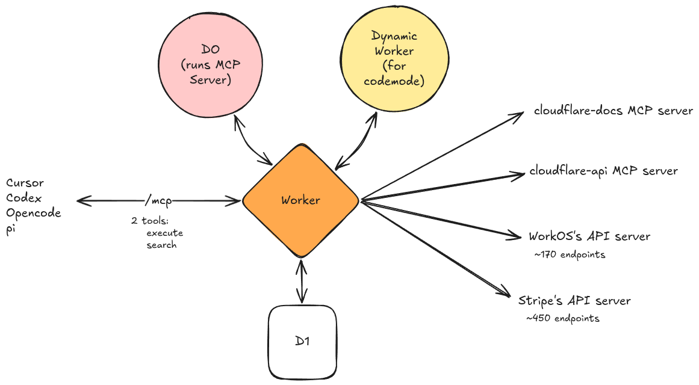

# dev-mcp

<p>
  
</p>

[](https://deploy.workers.cloudflare.com/?url=https://github.com/corrreia/dev-mcp)

Cloudflare-native MCP gateway for combining user-added MCP servers and OpenAPI APIs behind one authenticated endpoint.

The app exposes a TanStack Start dashboard for registering sources, then exposes a remote MCP endpoint with only two public tools:

- `search`
- `execute`

Internally, OpenAPI sources are cataloged from their specs and exposed inside Code Mode as callable functions. MCP sources are connected through a per-user Durable Object broker. Execution runs through Cloudflare Code Mode using Dynamic Workers with outbound network access disabled except for the source functions explicitly provided by the gateway.

Source configuration is per authenticated user. Each user gets their own source registry, catalog, MCP session Durable Object, and MCP broker Durable Object.

Code Mode runs on [Dynamic Workers](https://developers.cloudflare.com/dynamic-workers/). For background on the model, see Cloudflare's [Code Mode announcement](https://blog.cloudflare.com/code-mode/).

> dev-mcp is similar in spirit to [Cloudflare MCP Server Portals](https://developers.cloudflare.com/cloudflare-one/access-controls/ai-controls/mcp-portals/): it centralizes multiple MCP servers behind one authenticated endpoint. This project is intentionally smaller, easier to self-deploy, and aimed at individuals or small personal workspaces rather than organization-wide Zero Trust governance.

## Stack

- Cloudflare Workers
- Cloudflare D1 with Drizzle
- Durable Objects for MCP broker/session routing
- Worker Loader / Dynamic Workers for Code Mode execution
- TanStack Start
- Better Auth with OpenID Connect
- Better Auth MCP plugin for the remote MCP endpoint
- shadcn/ui

## Architecture



The dashboard is the control plane: it handles sign-in, source registration, source enablement, catalog refreshes, and endpoint discovery. The `/mcp` route is the data plane: it exposes only `search` and `execute`, then fans into user-enabled source functions inside Code Mode.

## UI References

- Dashboard route: `/`
- Login route: `/login`
- Source registration: OpenAPI and MCP source form with built-in examples.
- Source table: refresh, enable or disable, and delete registered sources.
- Catalog search: searches the user's enabled catalog entries.
- Endpoint panel: copies the authenticated remote MCP endpoint.
- OAuth popup flow: MCP OAuth sources open the upstream authorization URL and refresh the catalog after callback completion.

## Local Development

Create `.dev.vars`:

```ini
OIDC_CLIENT_SECRET=replace-me
BETTER_AUTH_SECRET=replace-with-random-secret
ENCRYPTION_KEY=replace-with-random-secret
```

`APP_URL`, `OIDC_ISSUER`, and `OIDC_CLIENT_ID` are non-secret Wrangler vars configured in `wrangler.jsonc`. Add them to `.dev.vars` only if you need local overrides.

`BETTER_AUTH_SECRET` and `ENCRYPTION_KEY` are required for deployed environments. A fixed Better Auth development secret is only used when running on localhost and neither secret is present.

The local OIDC redirect URL is:

```text
http://localhost:8787/api/auth/oauth2/callback/oidc
```

Run migrations locally:

```bash
npm run db:migrate:local
```

Start the app:

```bash
npm run dev
```

Open `http://localhost:8787`.

## Deployment

You can start from the official Cloudflare one-click deploy flow:

[](https://deploy.workers.cloudflare.com/?url=https://github.com/corrreia/dev-mcp)

The button uses Cloudflare's Workers deploy flow to clone the public Git repository, provision supported resources such as D1 and Durable Objects from `wrangler.jsonc`, and configure Workers Builds.

Create the D1 database:

```bash
npx wrangler d1 create dev-mcp
```

Copy the generated `database_id` into `wrangler.jsonc`, then set production secrets:

```bash
openssl rand -base64 48 | wrangler secret put BETTER_AUTH_SECRET
openssl rand -base64 48 | wrangler secret put ENCRYPTION_KEY
wrangler secret put OIDC_CLIENT_SECRET
```

Set production `APP_URL`, `OIDC_ISSUER`, and `OIDC_CLIENT_ID` in `wrangler.jsonc`.

Current production URL:

```text
https://dev-mcp.corrreia.workers.dev
```

Apply migrations and deploy:

```bash
npm run db:migrate:remote
npm run deploy
```

After deployment, configure the OIDC client redirect URL:

```text
https://dev-mcp.corrreia.workers.dev/api/auth/oauth2/callback/oidc
```

## Source Types

| Source type | Required fields | Supported auth |
| --- | --- | --- |
| OpenAPI | `baseUrl`, `specUrl` | none, bearer token, custom header |
| MCP | `baseUrl` | none, bearer token, custom header, OAuth |

Source URLs must use HTTPS. Secrets for user-added sources are encrypted before being stored in D1. OpenAPI specs and upstream API responses are read with a bounded 1 MB response limit to protect the Worker from oversized upstream responses.

OpenAPI sources are refreshed by downloading their JSON or YAML spec and indexing each operation into the catalog. Bearer and custom-header credentials are only sent when the spec URL has the same origin as the API base URL.

MCP OAuth sources use the MCP SDK OAuth client provider. The flow stores client information, PKCE verifier, OAuth state, and tokens encrypted in the source record. OAuth sources are cataloged after the callback completes and the upstream MCP server can list its tools.

## Gateway Tools

`search` runs Code Mode with these helper functions:

- `codemode.catalog(query)`: search enabled catalog entries.
- `codemode.spec()`: return a combined OpenAPI spec for enabled OpenAPI sources.
- `codemode.sources()`: list the user's registered source slugs, types, and names.

`execute` runs Code Mode with one function per enabled catalog entry:

- OpenAPI operations are exposed as `codemode.<source>_<operation>(requestOptions)`.
- MCP tools are exposed as `codemode.<source>_<tool>(args)`.

Execution code, result or error, status, and duration are logged to D1 in `execution_logs`.

## Public MCP Surface

The `/mcp` endpoint only exposes:

- `search`: inspect the combined catalog/spec surface.
- `execute`: run Code Mode against the user-enabled sources.

Per-source tools are not directly exposed to MCP clients. They are made available inside the sandbox as typed `codemode.*` functions.

The `/mcp` endpoint requires an authenticated Better Auth MCP session with a concrete user id. Each user's MCP session and upstream source broker are routed through user-scoped Durable Object names.
