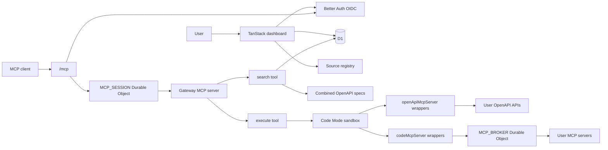

# dev-mcp

<p>
  
</p>

Cloudflare-native MCP gateway for combining user-added MCP servers and OpenAPI APIs behind one authenticated endpoint.

The app exposes a TanStack Start dashboard for registering sources, then exposes a remote MCP endpoint with only two public tools:

- `search`
- `execute`

Internally, OpenAPI sources are wrapped with `openApiMcpServer`, MCP sources are wrapped with `codeMcpServer`, and execution runs through Cloudflare Code Mode using Dynamic Workers.

## Stack

- Cloudflare Workers
- Cloudflare D1 with Drizzle
- Durable Objects for MCP broker/session routing
- Worker Loader / Dynamic Workers for Code Mode execution
- TanStack Start
- Better Auth with OpenID Connect
- shadcn/ui

## Architecture



## Local Development

Create `.dev.vars`:

```ini
APP_URL=http://localhost:8787
OIDC_ISSUER=https://auth.example.com
OIDC_CLIENT_ID=dev-mcp
OIDC_CLIENT_SECRET=replace-me
BETTER_AUTH_SECRET=replace-with-random-secret
ENCRYPTION_KEY=replace-with-random-secret
```

Run migrations locally:

```bash
npm run db:migrate:local
```

Start the app:

```bash
npm run dev
```

Open `http://localhost:8787`.

## Deployment

Create the D1 database:

```bash
npx wrangler d1 create dev-mcp
```

Copy the generated `database_id` into `wrangler.jsonc`, then set production secrets:

```bash
openssl rand -base64 48 | wrangler secret put BETTER_AUTH_SECRET
openssl rand -base64 48 | wrangler secret put ENCRYPTION_KEY
wrangler secret put OIDC_CLIENT_SECRET
```

Set production `APP_URL`, `OIDC_ISSUER`, and `OIDC_CLIENT_ID` in `wrangler.jsonc`.

Current production URL:

```text
https://dev-mcp.corrreia.workers.dev
```

Apply migrations and deploy:

```bash
npm run db:migrate:remote
npm run deploy
```

After deployment, configure the OIDC client redirect URL:

```text
https://dev-mcp.corrreia.workers.dev/api/auth/oauth2/callback/oidc
```

## Source Types

OpenAPI source:

- `baseUrl`: API base URL used for requests.
- `specUrl`: OpenAPI JSON or YAML URL.
- `auth`: none, bearer token, custom header, or OAuth placeholder.

MCP source:

- `baseUrl`: remote Streamable HTTP MCP endpoint.
- `auth`: none, bearer token, custom header, or OAuth placeholder.

Secrets for user-added sources are encrypted before being stored in D1.

## Public MCP Surface

The `/mcp` endpoint only exposes:

- `search`: inspect the combined catalog/spec surface.
- `execute`: run Code Mode against the user-enabled sources.

Per-source tools are not directly exposed to MCP clients. They are made available inside the sandbox as typed `codemode.*` functions.
